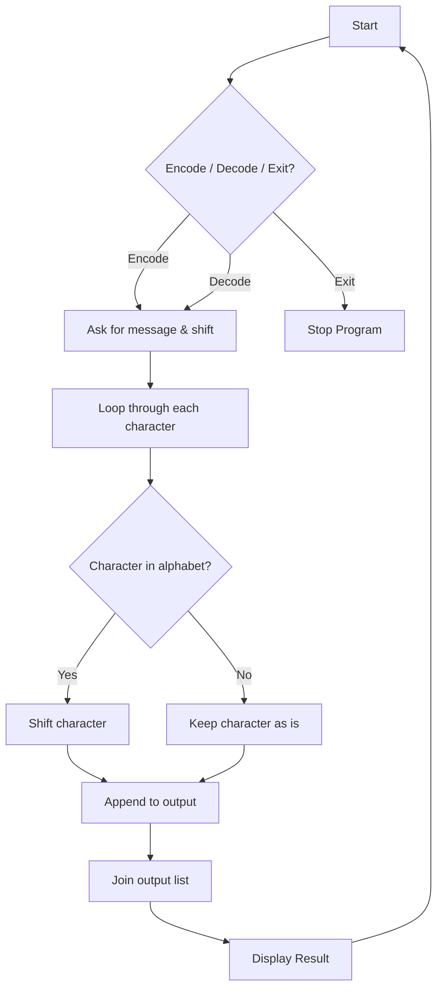

# Caesar-Cipher
🔐 Python program to **encode** and **decode** messages using the Caesar Cipher technique. Interactive CLI tool with continuous run support and clean design.

---

## 📖 Table of Contents
- [About the Project](#-about-the-project)
- [How It Works](#-how-it-works)
- [Features](#-features)
- [Flowchart](#-flowchart)
- [Tech Stack](#-tech-stack)
- [Installation](#-installation)
- [Usage](#-usage)
- [Examples](#-examples)
- [Future Improvements](#-future-improvements)
- [Contributing](#-contributing)
- [Author](#-author)

---

## 🧾 About the Project
The **Caesar Cipher** is one of the oldest forms of encryption, famously used by **Julius Caesar** to protect military secrets.  
This Python implementation allows you to **encrypt (encode)** and **decrypt (decode)** messages with a custom shift number.  
It’s simple, effective, and runs in a **loop** so you can keep encrypting/decrypting until you decide to **exit**.

---

## ⚙️ How It Works
1. Choose **encode**, **decode**, or **exit**.  
2. Enter your **message**.  
3. Enter your **shift value** (number of letters to shift).  
4. The program will transform your message while keeping spaces and symbols unchanged.  

---

## ✨ Features
- 🔑 **Customizable Encryption** – Encode messages with any shift value you choose.
- 🔓 **Instant Decryption** – Decode messages back using the same shift value.
- 🔁 **Continuous Run** – Perform multiple encryptions and decryptions without restarting the program.
- 📝 **Smart Handling of Characters** – Spaces, numbers, and special characters remain unchanged.
- 🔡 **Case-insensitive Input** – Works seamlessly with lowercase input (future support for uppercase planned).
- 🖥️ **User-Friendly CLI** – Clean prompts and output for easy interaction. 

---

## 📊 Flowchart


---

## 🛠 Tech Stack

* **Language:** Python 🐍
* **Concepts Used:** Strings, Lists, Functions, Loops, Conditionals

---

## 📥 Installation

1. Clone this repository:

   ```bash
   git clone https://github.com/sayedjaynurali/Caesar-Cipher.git
   ```
2. Navigate into the project folder:

   ```bash
   cd Caesar-Cipher
   ```
3. Run the script:

   ```bash
   python cipher.py
   ```

---

## ▶️ Usage

When you run the program, you’ll be prompted:

```
Type 'encode' to encrypt, type 'decode' to decrypt and 'exit' to STOP:
```

---

## 💡 Example

Encoding Example:
```
Type 'encode' to encrypt, type 'decode' to decrypt and 'exit' to STOP:
encode
Type your message:
hello world
Type the shift number:
5

Here is your encoded result: mjqqt btwqi
```
Decoding Example:
```
Type 'encode' to encrypt, type 'decode' to decrypt and 'exit' to STOP:
decode
Type your message:
mjqqt btwqi
Type the shift number:
5

Here is your decoded result: hello world
```

---

## 🚀 Future Improvements

* ✅ Support uppercase letters.
* ✅ Add support for Unicode characters & accented alphabets.
* ✅ GUI version using Tkinter or PyQt.
* ✅ Add brute-force decoder (auto tries all shifts).

---

## 🤝 Contributing

Contributions are welcome! Fork the repo and create a PR 🚀

---

## 🏅 Author

👤 **Sayed Jaynur Ali**
🎓 Physics Student | 💻 Aspiring Data Scientist | 🌱 Lifelong Learner

---

⭐ If you like this project, don’t forget to give it a star on GitHub!
