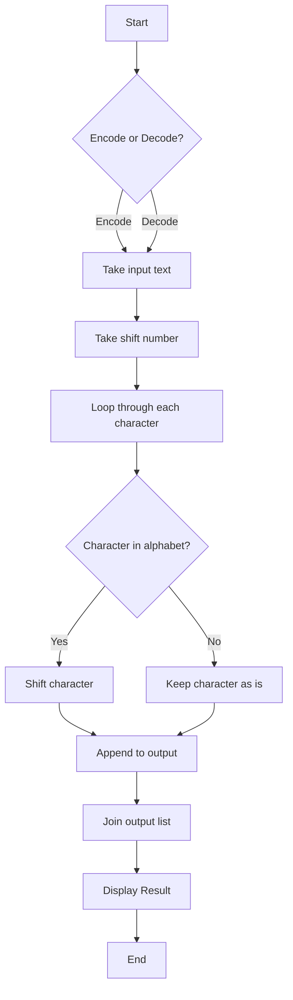

# Caesar-Cipher
📘 Python project implementing Caesar Cipher encryption &amp; decryption with customizable shifts. Great for showcasing coding, problem-solving, and cryptography basics.

# 🔐 Caesar Cipher Encoder/Decoder

A simple yet powerful **Caesar Cipher Encoder/Decoder** built in Python. This tool allows you to encrypt (encode) and decrypt (decode) secret messages with a custom shift value.

---

## 📖 Table of Contents

* [About the Project](#-about-the-project)
* [How It Works](#-how-it-works)
* [Flowchart](#-flowchart)
* [Features](#-features)
* [Tech Stack](#-tech-stack)
* [Installation](#-installation)
* [Usage](#-usage)
* [Example](#-example)
* [Future Improvements](#-future-improvements)
* [Contributing](#-contributing)

---

## 🧾 About the Project

The **Caesar Cipher** is one of the oldest and simplest encryption techniques, named after Julius Caesar who reportedly used it to send military secrets. This Python project brings the concept alive in a clean, interactive, and modern way.

---

## ⚙️ How It Works

* Choose whether to **encode** or **decode**.
* Enter your message.
* Enter the shift value.
* The program shifts each alphabet character accordingly while keeping spaces and symbols unchanged.

---

## 📊 Flowchart



---

## ✨ Features

* 🔑 Encode messages with a custom shift.
* 🔓 Decode encrypted messages.
* 💬 Keeps non-alphabet symbols unchanged.
* 🖥️ Simple CLI interface.

---

## 🛠 Tech Stack

* **Language:** Python 🐍
* **Concepts Used:** Strings, Lists, Functions, Conditionals

---

## 📥 Installation

1. Clone this repository:

   ```bash
   git clone https://github.com/your-username/caesar-cipher.git
   ```
2. Navigate into the project folder:

   ```bash
   cd caesar-cipher
   ```
3. Run the script:

   ```bash
   python cipher.py
   ```

---

## ▶️ Usage

When you run the program, you’ll be prompted:

```
Type 'encode' to encrypt, type 'decode' to decrypt:
Type your message:
Type the shift number:
```

---

## 💡 Example

```
Type 'encode' to encrypt, type 'decode' to decrypt:
encode
Type your message:
hello world
Type the shift number:
5

Output: mjqqt btwqi
```

```
Type 'encode' to encrypt, type 'decode' to decrypt:
decode
Type your message:
mjqqt btwqi
Type the shift number:
5

Output: hello world
```

---

## 🚀 Future Improvements

* ✅ Add support for larger alphabets (e.g., Unicode, accented letters).
* ✅ Add GUI version using Tkinter or PyQt.
* ✅ Add option for brute force decoding without shift.

---

## 🤝 Contributing

Contributions are always welcome! Feel free to fork this repo and submit a PR.

---

## 🏅 Author

👤 **Jaynur**
🎓 Physics Student | 💻 Aspiring Cybersecurity Expert | ⚔️ Future Infantry Officer | 🌱 Lifelong Learner

---

⭐ If you like this project, don’t forget to give it a star on GitHub!
